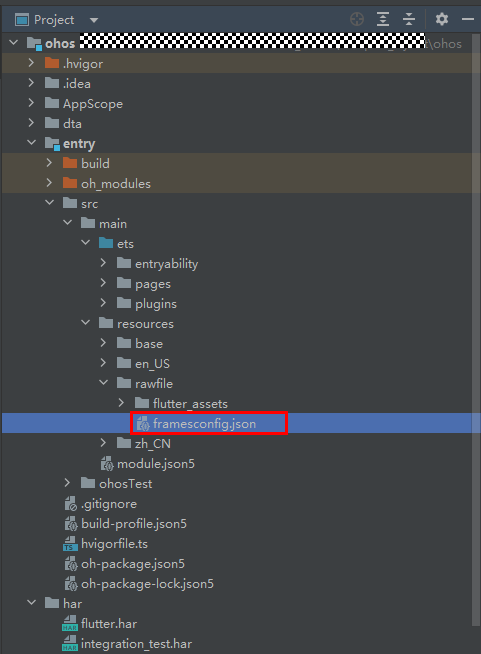
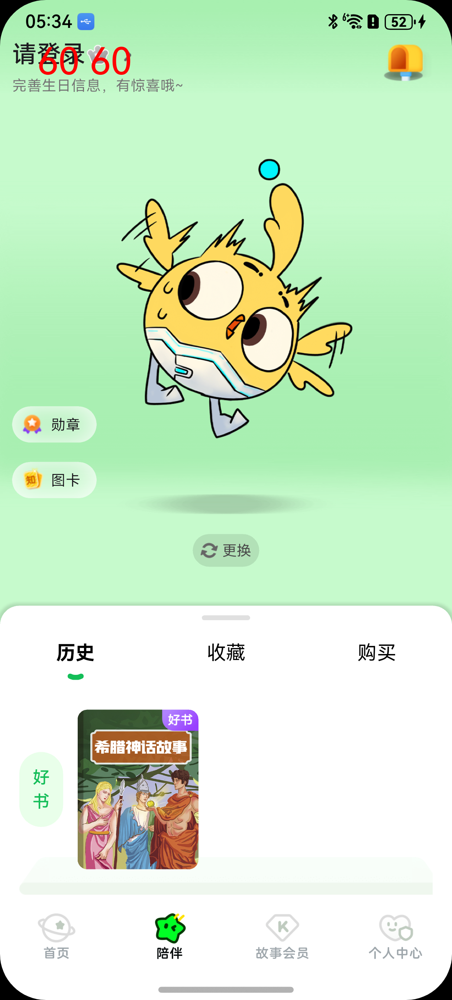

# 1.简介
ltpo功能是指屏幕帧率可变，在手机刷新率设置为“智能”时，应用可根据当前场景自动切换合适的帧率。

flutter三方框架将在6.0版本后上线ltpo功能，当前只在开发分支上合入ltpo功能。

注意：正式ROM版本上线前，ltpo功能的验证无法在外部进行。

# 2.应用适配依赖

|  依赖顺序   | 依赖项  |  说明  |
|  ----  |  ----  |  ----  |
| 1 | [deveco-studio](#deveco-studio) | IDE工具 |
| 2 | [flutter_flutter](#flutter-flutter) | 集成了ltpo功能的flutter sdk |
| 3 | [framesconfig.json](#frames-config) | ltpo的配置文件，配置使能开关 |


# 3.详情

## 3.1 <span id="deveco-studio">deveco-studio</span>
deveco-studio需要更新新版本，DevEco Studio 5.0.5 Release

链接：https://developer.huawei.com/consumer/cn/download/deveco-studio

## 3.2 <span id="flutter-flutter">flutter_flutter</span>
ltpo功能跟随flutter_flutter代码仓版本发布，请使用flutter_flutter代码仓的oh-3.22.0-dev-6.0分支进行具备ltpo功能的flutter应用开发。可查看历史提交中是否有6月5号合入的提交“Branch oh-3.27.4-dev update engine.ohos.version to bdcd16cd33b6cb565bf1be04752ff417e7d5bf54”。

链接：https://gitcode.com/openharmony-tpc/flutter_flutter/tree/oh-3.22.0-dev-6.0

已存在的flutter应用工程，如果不是flutter 3.22版本，在切换flutter_flutter oh-3.22.0-dev-6.0分支后，需要适配flutter 3.22版本。

## 3.3 <span id="frames-config">framesconfig.json</span>

链接：https://gitcode.com/openharmony-tpc/flutter_flutter/blob/oh-3.22.0-dev-6.0/packages/flutter_tools/templates/app_shared/ohos.tmpl/entry/src/main/resources/base/profile/framesconfig.json

1) framesconfig.json是ltpo的配置文件，可配置使能开关，默认不使能ltpo功能，需要手动开启。
2) ltpo配置文件，还预置了平移动画的速率映射帧率挡位，根据动画的平移速率来决定屏幕刷新率。默认映射帧率挡位配置，不推荐改动。
3) ltpo配置文件，预置在模板应用工程中，默认存在新建的flutter应用工程中。已存在的flutter应用工程，需要适配切换flutter 3.22版本，并手动拷贝framesconfig.json文件到应用工程ohos/entry/src/main/resources/rawfile路径下。


其原型文件在flutter_flutter下的packages/flutter_tools/templates/app_shared/ohos.tmpl/entry/src/main/resources/base/profile/framesconfig.json路径。


# 4.适用场景
|  序号   | 场景名称  |
|  ----  |  ----  |
| 1 | 自定义平移动画 |
| 2 | 转场动画 |
| 3 | 滑动列表 |
| 4 | 轮播图 |
| 5 | 视频（须另外适配） |


# 5.适配流程

1) 更新[deveco-studio](#deveco-studio)的IDE工具，至少使用DevEco Studio 5.0.5 Release版本。
2) 下载适配了ltpo功能的[flutter_flutter](#flutter-flutter)代码仓，并添加进环境变量。
3) 命令行窗口执行"flutter doctor -v"，确认flutter路径是否为适配了ltpo功能的flutter_flutter代码仓，其分支是否为oh-3.22.0-dev-6.0。
4) 确保适配应用是flutter 3.22 版本的。
5) 应用工程里的ltpo配置文件[framesconfig.json](#frames-config)确认是否存在。如果是新建的flutter应用工程，ltpo配置文件默认存在应用模板里；如果是已存在的应用工程，需要手动拷贝framesconfig.json文件到应用工程ohos/entry/src/main/resources/rawfile路径下。
6) 开启ltpo配置使能开关。framesconfig.json文件更改“SWITCH”选项，把0改为1。
7) 因为未实名调试整数有效期只有14天，实名之后是180天，14天之后应用就无法打开，所以请在开发者联盟网站实名认证，然后重新申请调试证书。https://developer.huawei.com/consumer/cn/doc/app/agc-help-add-debugcert-0000001914263178
8) 使用步骤7申请的调试证书编译release模式的应用工程。

# 6.验证流程

正式ROM版本上线前，ltpo功能的验证无法在外部进行。

# 7.FAQ

## 性能问题一
动画页面切换后台，动画仍然在执行。



“陪伴”页面有动画在循环播放，切换其他静置的页面后，屏幕刷新率未下降。问题原因是其页面切换后台未暂停动画。

有以下建议：

### 合理选择标签页页面的TabController
TabController的创建有两种形式，一种是使用系统的DefaultTabController，第二种是自己定义一个TabController实现SingleTickerProviderStateMixin。

1) 无状态控件(StatelessWidget)搭配DefaultTabController
2) 有状态控件(StatefulWidget)搭配TabController

```
// 示例代码
class TabsPage  extends StatefulWidget {
  @override
  State<TabsPage> createState() => _TabsPageState();
}

class _TabsPageState extends State<TabsPage>
    with SingleTickerProviderStateMixin {
  late TabController _tabController;

  @override
  void initState() {
    super.initState();
    _tabController = new TabController(
      vsync: this,
      length: 3 // 设置TabBarView数量
    );
  }

  @override
  void dispose() {
    _tabController.dispose();
    super.dispose();
  }

@override
  Widget build(BuildContext context) {
    ...
    TabBar(
        controller: _tabController,
        tabs: <Widget>[ ... ]
    ),
    ...
    TabBarView(
        controller: _tabController,
        children: <Widget>[ ... ]
    ),
  }
}
```

### TabView页签切换停止动画

有状态控件(StatefulWidget)生命周期deactivate，当框架从树中移除此 State 对象时将会调用此方法。可在此生命周期回调deactivate对AnimationController进行stop的操作。

如果是一个基于this的vsync周期循环的动画，重新进入页面后会自动播放，无须手动启动动画。

```
// 示例代码
class AnimationPage extends StatefulWidget {
  @override
  _AnimationPageState createState() => _AnimationPageState();
}

class _AnimationPageState extends State<AnimationPage>
    with SingleTickerProviderStateMixin {

    late AnimationController _controller;

  @override
  void deactivate() {
    super.deactivate();
    _controller.stop();
  }

  @override
  void initState() {
    super.initState();

    _controller = AnimationController(duration: Duration(seconds: 4), vsync: this)
      ..addListener(() {
        setState(() {});
      })
      ..repeat(reverse:true);

      ...
  }
}
```